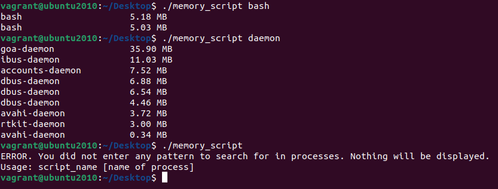

### Quickly find out how much RAM a process is using in most Linux distributions.

   

#### **How to use:**
1. Place this script in the user's home directory, or in any place that you want.
2. Type command `chmod +x memory_script` in the Terminal to give the script permission to execute.
3. Type command `./memory_script [name of process]` in the Terminal to view the RAM usage of a specific process.

