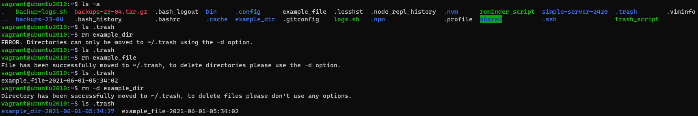

### A script that emulates the trash functionality found on Microsoft Windows and macOS for Linux server/GUI-less distros.

   

#### **Usage:**
1. Place this script in the user's home directory, or wherever you see fit.
2. Type command `chmod +x trash_script` to give script execution permission.
3. Add alias `alias rm='~/trash_script'` to `.bashrc` file, located in the current user's home directory.
4. Type command `. .bashrc` to refresh the Bash shell to apply the alias set above.  
5. To delete directory `example_dir`, type in `rm -d example_dir`.
6. To delete file `example_file`, type in `rm example_file`.  
  
**Note: To use the "real" `rm` command, type in `"rm" example_file`.**

#### **Programs required:**
- Vim or some other text editor

#### **Library dependencies:**
- N/A 
