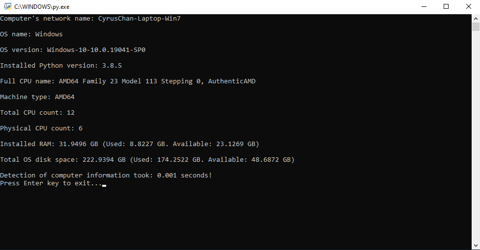

### Quickly find out the specifications of a computer so you can focus on doing what is actually important.  
  
#### **Note: This script is built with cross-platform in mind, it supports Microsoft Windows, macOS, and most distributions of Linux.**

   

#### **Usage:**
1. Run `main.py`.
2. Follow the prompts on-screen.

#### **Programs required:**
- Python 3
- Visual Studio Code (Optional)

#### **Python library dependencies:**
- psutil 5.8.0 

To easily install, use the command `pip3 install -r requirements.txt`.
