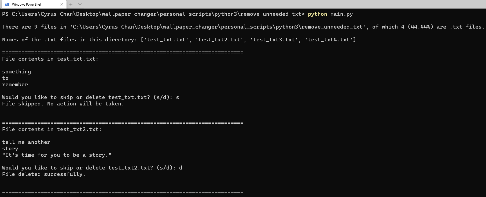
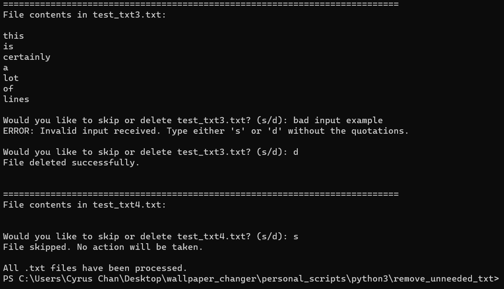

### A script to preview all .txt files in a directory, and provide an easy way to skip or delete them — all in one place.

   

  
#### **Disclaimer:** Only delete .txt files that you are certain you want to delete, as recovery may be difficult.
I am NOT responsible for what you do with this script.

#### **Usage:**  
1. Place `main.py` in the directory that you want to remove unneeded .txt files.
2. Run `main.py` via typing `python main.py` in a command-line interpreter program like Windows PowerShell, or double-click the file `main.py`.  

#### **Programs required:**
- Python 3
- Visual Studio Code (Optional)

**Note: There are no Python library dependencies that require installation.**
